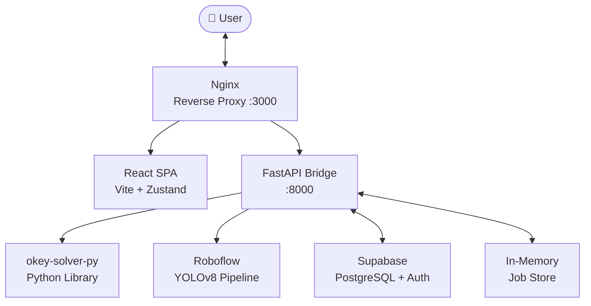

<div align="center">

# Istaka Ustası
### Okey Solver · Computer Vision · Real-time Optimization

[](https://github.com/AtaCanYmc/IstakaUstasi/actions/workflows/ci.yml)
[](https://github.com/AtaCanYmc/IstakaUstasi/releases)
[](LICENSE)
[](https://www.typescriptlang.org/)
[](https://www.python.org/)
[](https://fastapi.tiangolo.com/)
[](https://react.dev/)

**A production-grade, full-stack web application that solves Okey and 101 Okey tile arrangements using combinatorial optimization algorithms and computer vision — all within a single Docker Compose command.**

[**Live Demo**](https://atacanymc.github.io) · [**API Docs**](http://localhost:8000/docs) · [**Changelog**](CHANGELOG.md) · [**Contributing**](CONTRIBUTING.md)

</div>

---

## Overview

Istaka Ustası bridges physical Okey gameplay with mathematical optimization. Upload a photo of your physical rack or manually build your hand in the browser — the solver engine computes the highest-scoring meld arrangement across Runs (*Seri*), Groups (*Per*), and Doubles (*Çift*) in milliseconds.

The application is architected as a **full-stack monorepo**:

| Layer | Technology | Role |
|-------|-----------|------|
| **Frontend SPA** | React 19, TypeScript, Vite, Zustand | Interactive rack board & vision upload UI |
| **Bridge API** | Python 3.11, FastAPI, Pydantic | Solver orchestration & vision pipeline |
| **Computer Vision** | Roboflow Inference, YOLOv8 | Tile detection from rack photographs |
| **Database & Auth** | Supabase (PostgreSQL + GoTrue) | User management, encrypted key storage |
| **Infrastructure** | Docker, Nginx, GitHub Actions | Build, proxy, CI/CD |

---

## Features

### 🧮 Multi-Strategy Solver Engine
Eight interchangeable optimization strategies cover the entire spectrum from exact solutions to fast heuristics:

| Strategy | Description | Best For |
|----------|-------------|----------|
| **Backtracking** | Exhaustive DFS with pruning (default) | Correctness-critical hands |
| **Greedy** | Highest-value-first selection | Ultra-fast approximate results |
| **ILP** | Integer Linear Programming via PuLP | Mathematically optimal guarantee |
| **Hybrid** | Greedy seed + backtracking refinement | Balance of speed and accuracy |
| **Beam Search** | Width-limited best-first search | Large hand exploration |
| **Genetic** | Evolutionary crossover/mutation | Highly complex configurations |
| **Simulated Annealing** | Temperature-controlled random walk | Escaping local optima |
| **MCTS** | Monte Carlo Tree Search | Statistical sampling approach |

### 📸 Asynchronous Vision Pipeline
- Upload a rack photo via **drag-and-drop** or file picker
- Image is validated, EXIF-stripped, and dispatched as a **background job** (202 Accepted)
- Frontend **long-polls** the job status endpoint until completion
- Detected tiles are automatically placed on the interactive rack board
- Two modes: **Extract Only** (populates rack) or **Extract & Solve** (one-click full analysis)

### 🔒 Security-First Image Handling
Uploaded images pass through a four-layer validation pipeline before any processing occurs:
1. **Size gate** — Hard 5 MB ceiling enforced at ingress
2. **Magic-byte verification** — Binary signature validation for JPEG (`\xff\xd8\xff`), PNG (`\x89PNG`), and WebP (`RIFF…WEBP`)
3. **Pillow decode + verify** — Structural integrity check using PIL's strict verification mode
4. **EXIF sanitization** — Clean re-encode strips all embedded metadata before forwarding

### 🎮 Interactive Rack Board
- **40-slot grid** (2 rows × 20 columns) mirroring a physical Okey rack
- **Drag-and-drop** tile repositioning via `@hello-pangea/dnd`
- **Smart layout algorithm**: melds are placed sequentially with visual separation; remaining tiles collect at the tail
- Okey indicator (*Gösterge*) tile configuration for wildcard assignment
- One-after-one (`allowOneAfter`) toggle for extended run validation

### 🌍 Full Internationalization
Complete locale support for **Turkish**, **English**, **French**, and **German** — including solver strategy names, error messages, and UI copy.

### 🔑 BYOK — Bring Your Own Key
Every user stores their own encrypted Roboflow API key in Supabase. The backend decrypts it per-request using AES encryption. There are no shared rate limits or quotas.

---

## Architecture



### Request Flow — Vision Solve

```
POST /api/v1/vision/solve
       │
       ├─► Image validation (magic bytes + EXIF strip)
       ├─► Decrypt user Roboflow credentials from Supabase
       ├─► Create Job (UUID) → 202 Accepted
       │
       └─► BackgroundTask
              ├─► Roboflow Workflow → YOLOv8 inference
              ├─► Tile coordinate parsing
              ├─► okey-solver-py: optimal arrangement
              └─► Job store updated (completed / failed)

GET /api/v1/vision/jobs/{job_id}   ← polled by frontend every 1s
       └─► { status, result, error }
```

### Directory Structure

```
IstakaUstasi/
├── backend/                   # FastAPI bridge microservice
│   ├── app/
│   │   ├── core/              # Exception handlers
│   │   ├── db/                # Repository pattern (base + Supabase impl)
│   │   ├── dependencies/      # Auth & image validation middleware
│   │   ├── models/            # Pydantic request/response schemas
│   │   ├── routers/           # auth · solver · vision endpoints
│   │   ├── services/          # UserService · JobService · EncryptionService
│   │   ├── utils/             # i18n message helpers
│   │   └── main.py            # FastAPI app entrypoint
│   ├── tests/                 # pytest test suite
│   ├── Dockerfile
│   └── requirements.txt
│
├── frontend/                  # React SPA
│   ├── src/
│   │   ├── components/        # Board · Tile · TilePool · VisionUpload · …
│   │   ├── i18n/              # translations.ts (tr/en/fr/de)
│   │   ├── pages/             # Dashboard
│   │   ├── services/          # Axios API client
│   │   ├── store/             # Zustand global state
│   │   └── App.tsx
│   ├── Dockerfile
│   └── vite.config.ts
│
├── supabase/
│   └── migrations/            # SQL migration files
├── docker-compose.yml
├── render.yaml                # Render.com deployment manifest
└── .github/workflows/         # CI/CD pipelines
```

---

## Getting Started

### Prerequisites

| Tool | Minimum Version |
|------|----------------|
| Docker | 20.10+ |
| Docker Compose | v2.x |
| Node.js *(manual setup only)* | 20.x |
| Python *(manual setup only)* | 3.11.x |

### 1 — Clone

```bash
git clone https://github.com/AtaCanYmc/IstakaUstasi.git
cd IstakaUstasi
```

### 2 — Configure Environment

Create `backend/.env` from the provided example:

```bash
cp backend/.env.example backend/.env
```

Edit `backend/.env`:

```env
# ── Supabase ──────────────────────────────────────────────────────────
SUPABASE_URL=https://<your-project-id>.supabase.co
SUPABASE_KEY=<your-service-role-secret-key>       # Must be service_role, not anon

# ── Roboflow (server-side fallback, optional) ─────────────────────────
OKEY_RF_KEY=<your-roboflow-private-api-key>
OKEY_RF_WORKSPACE=ata-dc7ry
OKEY_RF_WORKFLOW_ID=okey-and-rummikub-vrummikub-p8akb-vr0ef-3-yolov8n-t1-logic
OKEY_RF_API_URL=https://serverless.roboflow.com

# ── Database Provider ─────────────────────────────────────────────────
DB_PROVIDER=supabase
```

> **Important:** `SUPABASE_KEY` must be the **service_role** key (found under *Project Settings → API*). The `anon` key will cause RLS policy violations on user creation.

### 3 — Initialize the Database

Open the **Supabase SQL Editor** and run the migration files in order:

```bash
# File listing:
supabase/migrations/
  20260719000000_init.sql              # users, quota_logs tables
  20260719000100_separate_quotas.sql   # schema cleanup
  20260720000000_user_keys.sql         # user_roboflow_keys table + RLS
  20260720000100_remove_solver_quota.sql
```

Or link and push via the Supabase CLI:

```bash
supabase link --project-ref <project-id>
supabase db push
```

### 4 — Launch with Docker Compose

```bash
docker compose up --build
```

| Service | URL |
|---------|-----|
| Frontend SPA | http://localhost:3000 |
| FastAPI Backend | http://localhost:8000 |
| Swagger UI | http://localhost:8000/docs |
| ReDoc | http://localhost:8000/redoc |

---

## Manual Local Development

<details>
<summary><strong>Backend</strong></summary>

```bash
cd backend
python -m venv .venv
source .venv/bin/activate          # Windows: .venv\Scripts\activate
pip install -r requirements.txt

# Install pre-commit hooks (black + isort + flake8)
pre-commit install

# Start dev server with hot-reload
uvicorn app.main:app --reload --host 0.0.0.0 --port 8000
```

</details>

<details>
<summary><strong>Frontend</strong></summary>

```bash
cd frontend
npm install
npm run dev       # Vite dev server at http://localhost:5173
```

</details>

---

## Testing

### Backend

```bash
cd backend
pytest tests/ -v
```

### Frontend

```bash
cd frontend
npm run test          # Vitest + jsdom
npm run test:coverage # With coverage report
```

---

## Roboflow Setup (BYOK)

Users bring their own Roboflow credentials. After signing in, open **Settings** and fill in:

| Field | Where to find it |
|-------|-----------------|
| **Private API Key** | Roboflow Dashboard → *Profile → Settings → API Keys* |
| **Workspace Name** | Visible in the browser URL: `app.roboflow.com/<workspace>/…` |
| **Workflow ID** | *Workflows* menu → create a workflow with YOLOv8 tile detection → copy ID |
| **API URL** | `https://serverless.roboflow.com` (default) |

Credentials are AES-encrypted before storage and decrypted server-side per request. They are never transmitted to the client in plaintext.

---

## API Reference

All endpoints are prefixed with `/api/v1`.

| Method | Path | Description |
|--------|------|-------------|
| `GET` | `/health` | Service health check |
| `POST` | `/auth/signup` | Register a new user |
| `POST` | `/auth/login` | Authenticate and receive tokens |
| `POST` | `/auth/sync` | Sync profile (call after token refresh) |
| `GET` | `/auth/roboflow-key` | Fetch masked Roboflow config |
| `POST` | `/auth/roboflow-key` | Save / update Roboflow credentials |
| `DELETE` | `/auth/roboflow-key` | Remove Roboflow credentials |
| `POST` | `/solver/arrange` | Solve a tile hand from JSON input |
| `POST` | `/vision/extract` | Submit rack image → extract tiles (async) |
| `POST` | `/vision/solve` | Submit rack image → extract + solve (async) |
| `GET` | `/vision/jobs/{job_id}` | Poll async job status |

Full interactive documentation available at `/docs` (Swagger UI) or `/redoc` (ReDoc).

---

## Deployment

The backend ships with a `render.yaml` manifest for one-click deployment to [Render.com](https://render.com):

```bash
# From the Render dashboard, connect the repository and set the following env vars:
SUPABASE_URL
SUPABASE_KEY
OKEY_RF_KEY
OKEY_RF_WORKSPACE
OKEY_RF_WORKFLOW_ID
OKEY_RF_API_URL
```

The frontend can be deployed as a static site to **GitHub Pages**, **Netlify**, or **Vercel** by building the Vite output:

```bash
cd frontend
npm run build    # Output: dist/
```

---

## Observability

The backend integrates **OpenTelemetry** (via `opentelemetry-sdk`) with structured JSON logging via **structlog**. Every HTTP span, background task, and Roboflow call is traced and correlated by `trace_id`.

---

## Contributing

Contributions are welcome. Please read [CONTRIBUTING.md](CONTRIBUTING.md) before opening a pull request — it covers branch naming, commit conventions, linting requirements, and the PR review process.

---

## Security

To report a vulnerability, follow the responsible disclosure process described in [SECURITY.md](SECURITY.md). Do **not** open a public GitHub issue for security-related findings.

---

## License

Distributed under the **Apache 2.0 License**. See [LICENSE](LICENSE) for the full text.

---

<div align="center">

Developed with care by [Ata Can Yaymacı](https://github.com/AtaCanYmc) · Turkey 🇹🇷

</div>
