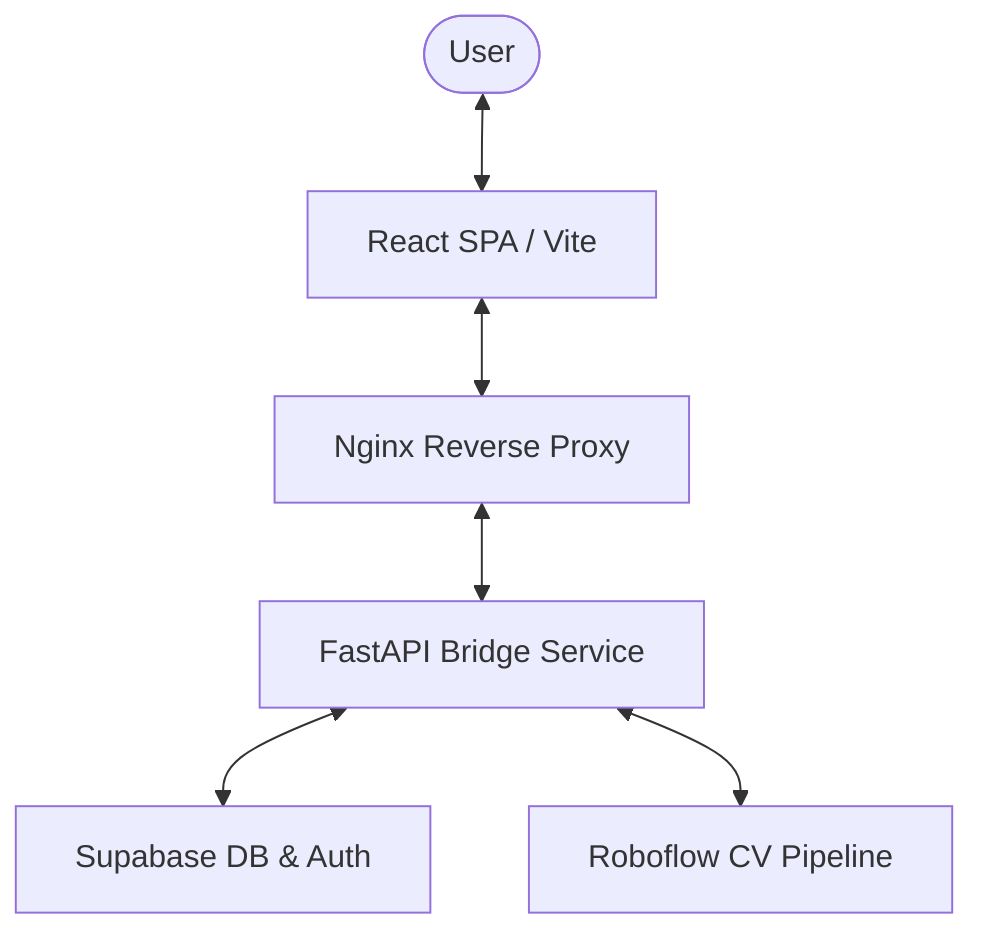

# 🀄 Istaka Ustası (Okey Solver & Vision App)

[](https://github.com/AtaCanYmc/IstakaUstasi/actions/workflows/ci.yml)
[](https://github.com/AtaCanYmc/IstakaUstasi/releases)
[](LICENSE)
[](https://www.typescriptlang.org/)
[](https://www.python.org/)

---

## 📝 Executive Summary

**Istaka Ustası** is a production-grade, full-stack application designed to solve Okey and 101 Okey board arrangements. It utilizes advanced combinatorial optimization engines to calculate the highest scoring tile melds (Runs, Groups, and Doubles) while providing a state-of-the-art computer vision pipeline to extract tile states directly from photos of physical racks.

By pairing a modular React SPA with a highly optimized Python FastAPI solver, Istaka Ustası bridges physical gameplay and optimization mathematics, offering players an automated assistant to analyze and perfect their hands in real time.

---

## 🚀 Key Features

- **Combinatorial Solver Engine**: Multi-strategy solvers (Backtracking, Greedy, Integer Linear Programming (ILP), and Hybrid models) to find optimal tile arrangements.
- **Asynchronous AI Vision Pipeline**: Real-time tile extraction and board arrangement from upload image streams, running on non-blocking background threads with real-time polling.
- **Secure File Sanitization**: Multi-layer binary signature validation (Magic Bytes) protecting against arbitrary code execution, alongside EXIF metadata stripping and strict size limit enforcement.
- **Interactive Drag & Drop Board**: Seamlessly mirror your physical rack layout inside the React UI with automatic meld separation.
- **Extensible Quota Management**: Dedicated quota tracking tables on Supabase database to limit usage and ensure fair resource sharing.
- **Internationalization**: Full locale support for Turkish (`tr`), English (`en`), French (`fr`), and German (`de`).

---

## 🏗 System Architecture & Tech Stack

### Monorepo Data Flow


### Technology Matrix
- **Frontend**: React 19, TypeScript, Zustand (Granular Selective Store State), Tailwind CSS v4, `@hello-pangea/dnd`, Vitest, jsdom.
- **Backend**: Python 3.11, FastAPI, Pydantic (networks, validation), PIL (Pillow), PuLP (ILP Solver), pytest, pytest-asyncio.
- **Infrastructural**: Docker & Docker Compose, Nginx, GitHub Actions.

---

## ⚙️ Prerequisites

Ensure you have the following tools installed locally:
- **Node.js**: `v20.x` or higher
- **Python**: `3.11.x`
- **Docker**: `v20.10.x` or higher
- **Docker Compose**: `v2.x` or higher

---

## 🛠 Setup & Local Development

### 1. Klonlama (Cloning)
```bash
git clone https://github.com/AtaCanYmc/IstakaUstasi.git
cd IstakaUstasi
```

### 2. Configuration (`.env`)
Create a `.env` file in the `backend` directory. Refer to [backend/.env.example](file:///Users/atacan/ata-codes/IstakaUstasi/backend/.env.example):
```env
SUPABASE_URL=https://your-project.supabase.co
SUPABASE_KEY=your-anon-key
OKEY_RF_KEY=your-roboflow-key
OKEY_RF_WORKSPACE=your-rf-workspace
OKEY_RF_WORKFLOW_ID=your-workflow-id
```

### 3. Docker Deployment (Recommended)
Launch the entire stack inside container isolated environments with one command:
```bash
docker compose up --build
```
- **Frontend SPA**: [http://localhost:3000](http://localhost:3000)
- **FastAPI Backend**: [http://localhost:8000](http://localhost:8000)

### 4. Manual/Local Setup

#### Backend Setup
```bash
cd backend
python -m venv .venv
source .venv/bin/activate
pip install -r requirements.txt
uvicorn app.main:app --reload --port 8000
```

#### Frontend Setup
```bash
cd frontend
npm install
npm run dev
```

---

## 🧪 Testing

Both layers maintain testing baselines to ensure code quality:

### Run Backend Tests
Ensure your python virtual environment is active:
```bash
cd backend
pytest tests/
```

### Run Frontend Tests
```bash
cd frontend
npm run test
```

---

## 📖 API Documentation

Once the backend is running, access documentation schemas at:
- **Swagger UI**: [http://localhost:8000/docs](http://localhost:8000/docs)
- **ReDoc**: [http://localhost:8000/redoc](http://localhost:8000/redoc)

---

## 🤝 Contributing

Contributions are welcome! Please review [CONTRIBUTING.md](file:///Users/atacan/ata-codes/IstakaUstasi/CONTRIBUTING.md) for code styling guidelines, repository standards, and submission protocols.

---

## 🔒 Security

For reporting security vulnerabilities, please refer to [SECURITY.md](file:///Users/atacan/ata-codes/IstakaUstasi/SECURITY.md).

---

## 📄 License & Contact

Distributed under the MIT License. See [LICENSE](file:///Users/atacan/ata-codes/IstakaUstasi/LICENSE) for more information.

Developed by [Ata Can](https://github.com/AtaCanYmc).
