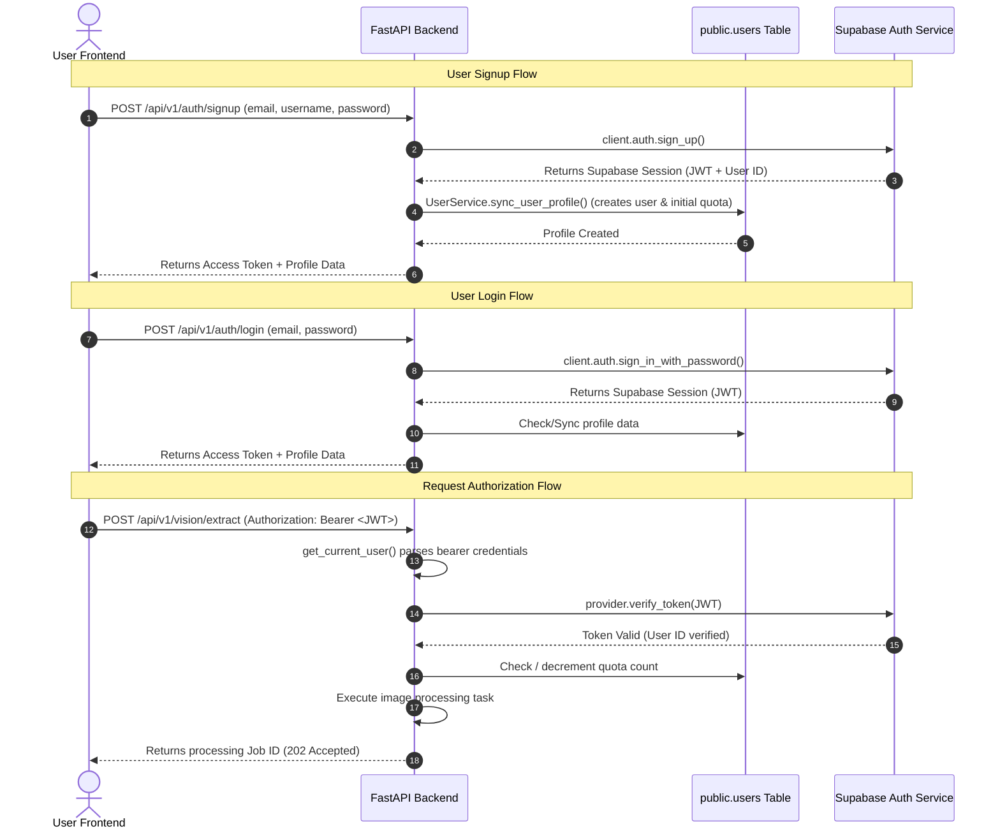

# Supabase Authentication Architecture

This document describes how User Authentication and Authorization flows are structured in the **IstakaUstasi** application.

---

## Architecture Overview

Authentication in this project is managed by combining **Supabase Auth** (as the identity provider and token generator) with the **FastAPI Backend** (acting as the proxy controller and quota validator).

The backend exposes customized endpoints to register, login, and verify tokens, which translates internally to Supabase operations. This allows the frontend to remain clean while the backend manages custom user settings and database transactions (e.g. tracking image quotas).

---

## Detailed Flows

### 1. User Registration (Signup)
- **Endpoint**: `POST /api/v1/auth/signup`
- **Controller**: [auth.py](file:///Users/atacan/ata-codes/IstakaUstasi/backend/app/routers/auth.py#L25-L76)
- **Process**:
  1. The backend receives the email, password, and chosen username.
  2. It makes a registration call to the Supabase client (`client.auth.sign_up`).
  3. Upon success, the backend initializes the user's public metadata (e.g., setting starting image quota counts to 5) and creates a row inside the `public.users` table using `UserService.sync_user_profile`.
  4. Returns the JWT token session to the frontend.

### 2. User Authentication (Login)
- **Endpoint**: `POST /api/v1/auth/login`
- **Controller**: [auth.py](file:///Users/atacan/ata-codes/IstakaUstasi/backend/app/routers/auth.py#L79-L114)
- **Process**:
  1. The backend receives the user's credentials.
  2. Tries to authenticate via `client.auth.sign_in_with_password`.
  3. If authentication is successful, it ensures the user's details and active quota profiles are synchronized in the public schema.
  4. Returns the Supabase Session data (`access_token`, `refresh_token`) to the frontend.

### 3. Route Protection (Authorization)
- **Dependency**: [auth.py](file:///Users/atacan/ata-codes/IstakaUstasi/backend/app/dependencies/auth.py)
- **Mechanism**:
  - Secure routes like image extraction and solving require the `get_current_user` dependency.
  - This dependency reads the token from the standard `Authorization: Bearer <token>` HTTP header.
  - The token is verified securely against Supabase Auth. Once verified, user quotas are updated statelessly.
